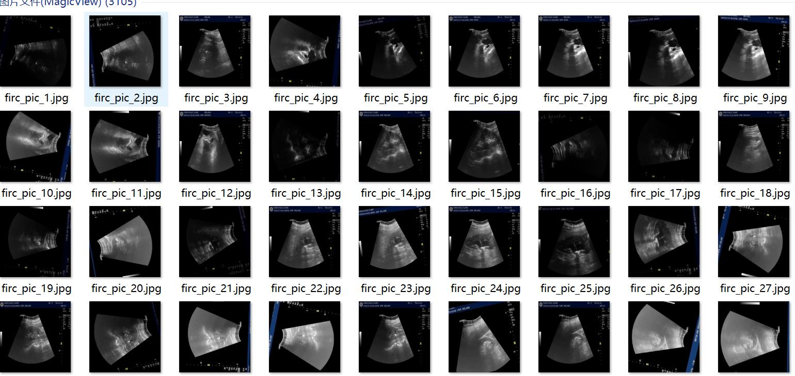
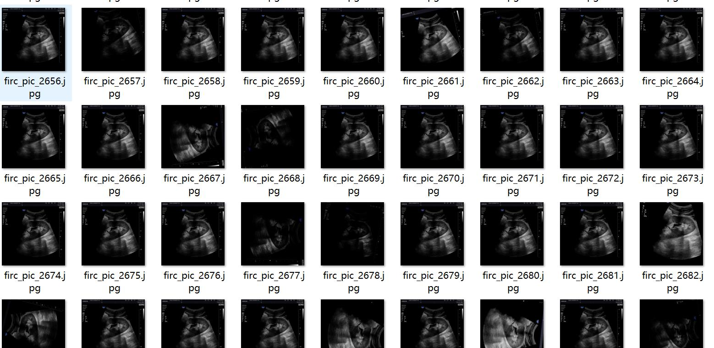
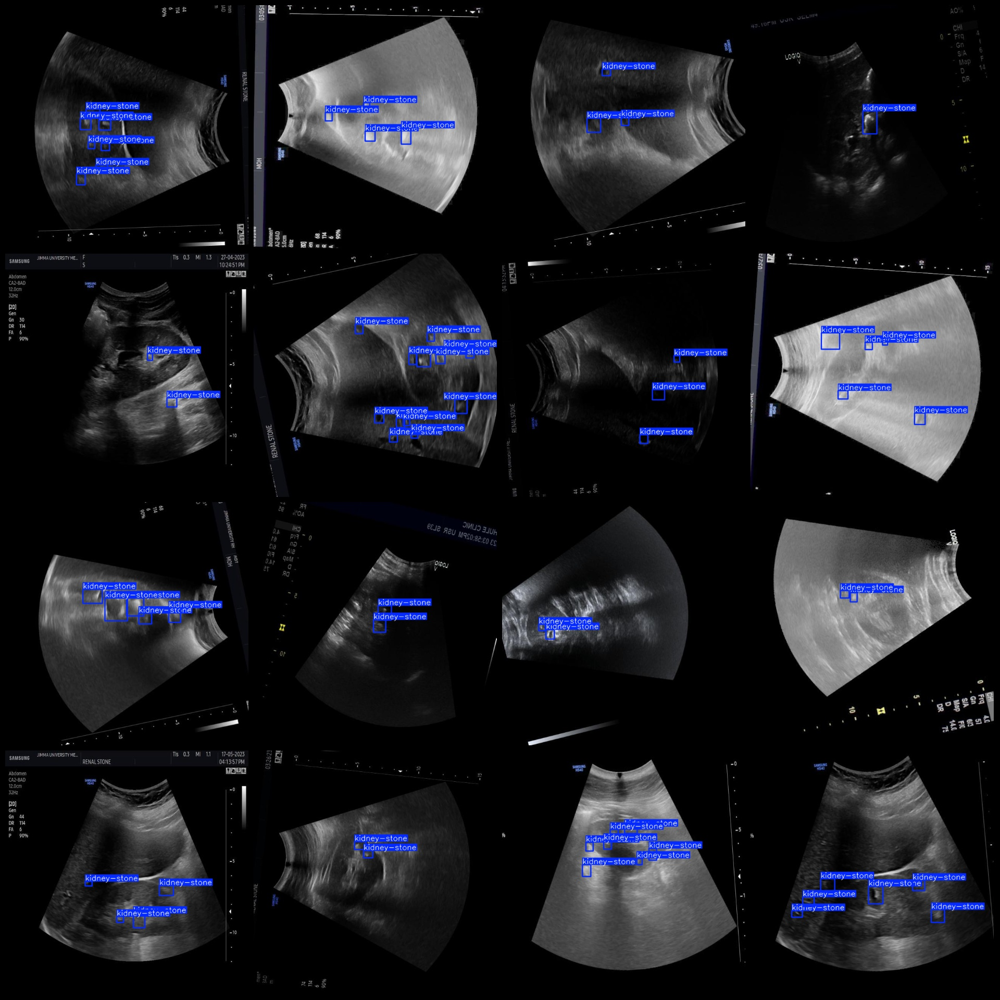
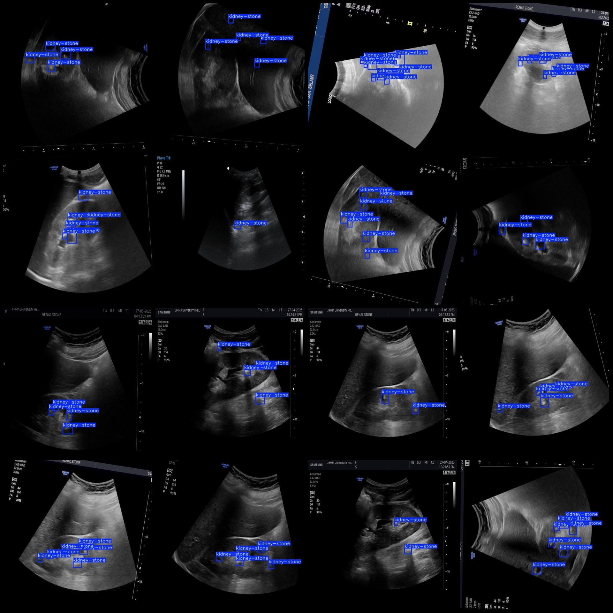

# Intelligent Medical Urology Ultrasound Kidney Stone Detection Dataset VOC+YOLO Format with 3105 Images and 1 Category

Please note that approximately one-third of the data in this dataset consists of original images, while the remaining are enhanced images. 

The dataset format is as follows: Pascal VOC format plus YOLO format (excluding the split path in the txt file, only including JPG images along with corresponding VOC format xml files and yolo format 
txt files).

Number of images (JPG file count): 3105
Number of annotations (xml file count): 3105
Number of annotations (txt file count): 3105
Number of categories: 1
Annotation category name: "kidney-stone"
Number of bounding boxes for each category:
kidney-stone = 15102
Total bounding boxes = 15102
Number of images per category:
kidney-stone = 3105
Image resolution: 640x640
Annotation tool used: labelImg
Annotation rule: Draw a bounding box around the category
Important note: The dataset does not have a split for training/validation/testing sets; you must divide them yourself.
Special declaration: This dataset does not guarantee the accuracy of the trained model or weight files.
Image preview:
Annotation example:

## Images

Here is a pay link on Stripe ( https://buy.stripe.com/3cs8yP7sY87d0vu9AB ). Please contact me lonlonago@foxmail.com after funding $89, and I will send you a complete data files , thank you!

